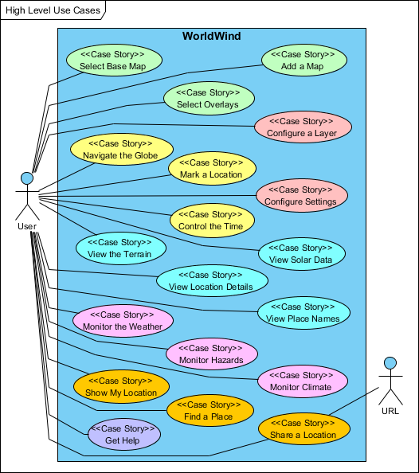

# WorldWindEarth | Explorer
An HTML5/JavaScript geo-browser built with the [WorldWindJS](https://emxsys.github.io/worldwindjs) library plus the KnockoutJS and Bootstrap libraries.

## Overview
The WorldWind Explorer is a geospatial web application for visualizing the earth. 
It uses the NASA WebWorldWind SDK to display a 3D globe with terrain and imagery 
as well as 2D maps. 

### Features

- Preconfigured imagery and map layers
- Ability to add external WMS map servers for additional imagery
- Layers can be sorted and opacity can be adjusted
- A day/night and atmosphere layer for realistic visual effects
- Shareable bookmark URLs that can be pasted into emails or saved in your browser
- Search box to goto a location 
- Automatic time zone detection
- Keyboard controls to pan, zoom and reset the globe
- Markers that can be dragged and dropped on the globe
- Weather Scouts that can be placed on the globe to obtain point weather forecasts from the National Weather Service (US-only)
- Time widget that shows current time at the crosshairs plus sunrise, sunset and solar hour
- Location widget that shows the coordinates and elevation at the crosshairs, plus the slope and aspect of the terrain and the solar azimuth angle
- Collapsible layer manager and output/info panels
- A time slider and controls to advance and retard the time used for day/night dispaly and weather forecasts 
- Setting are saved between sessions
- Mobile/responsive layout

### Objectives
- Be a useful web application in its own right
- Be an example of a NASA WebWorldWind SDK base project that is easy to fork and customize.

### Open Source Credits
- NASA WorldWind
- Knockout
- Bootstrap
- JQuery
- Dragula
- SplitJS
- Vis
- Moment

### Important Links
- Explorer Web App: http://worldwind.earth/explorer
- Explorer project: https://github.com/WorldWindLabs/WorldWindExplorer
- NASA WorldWind website: https://worldwind.arc.nasa.gov
- NASA Web WorldWind SDK on GitHub: https://github.com/NASAWorldWind/WebWorldWind

---

## Usage Instructions

### Globe Navigation

#### Mouse/Touch Controls
- Zoom with your mouse wheel (pinch gesture for mobile devices).
- Pan the globe by dragging the mouse or your finger. 
- Tilt the globe by dragging the right mouse button or your two fingers upward/downward.
- Rotate the globe by dragging the right mouse button or your two fingers left/right.

#### View Controls
- A set of view controls overlaid on the globe allow zoom, rotate, tilt, and vertical exaggeration.

#### Keyboard Controls
- You must set the focus on the globe (click on the globe) for keyboard controls to work
- Panning: use the _up_, _down_, _left_, _right_ arrow key
- Zooming: use the _+_ and _-_ minus keys to zoom
- Holding a key down will repeat at a progressively faster rate
 
### Time Widget
- The application's date and time, are displayed in the body of the widget. These values are controlled by the time slider.
- The sun icon that orbits the dial indicates the local solar hour angle. Solar noon is at the top of the dial, and midnight is at the bottom. When the sun icon is at the top of the dial, then the real sun is at its zenith. To see it in action, either move the time slider, or zoom out on the globe and move the crosshairs in an easterly or westerly direction. Note that the sun icon turns dark during nighttime hours.
- The sunrise and sunset markers depict the solar hour angles for for sunrise and sunset and indicate the amount of sunlight received. They are relative to the application date/time and the geographic position. To see them in action, zoom out on the globe and then pan north and south to the poles, or rapidly advance the time slider.

### Location Widget
- The latitude, longitude and ground elevation are displayed for the point under the crosshairs.
- The compass needle and compass rose rotate with your view of the globe and always point to true North.
- The sky/ground background is an inclinometer that rotates to display the slope of the terrain under the crosshairs. To see it in action, zoom in on the globe to see some elevation and then move the crosshairs across the terrain.
- The red diamond icon that orbits the compass indicates the aspect of the terrain under the crosshairs. Its position is relative to the compass points. To see it in action, zoom in on the globe to see a ridgeline and then move the crosshairs back and forth across the ridge.
- The sun icon that orbits the compass indicates the solar azimuth angle. Its position is relative to compass points. To see it in action, either move the time slider, or zoom out on the globe and move the crosshairs in an easterly or westerly direction. When the sun icon and aspect icon are coincident then the maximum solar radiation is received by the terrain at that point. Note that the sun icon turns dark during nighttime hours.

---

## Developer Notes

### Debugging
- In `js/main.js` set the `window.DEBUG` flag to true to put the app in debug mode.
- The `window.DEBUG` flag controls whether to use the minified or debug versions of libraries.
